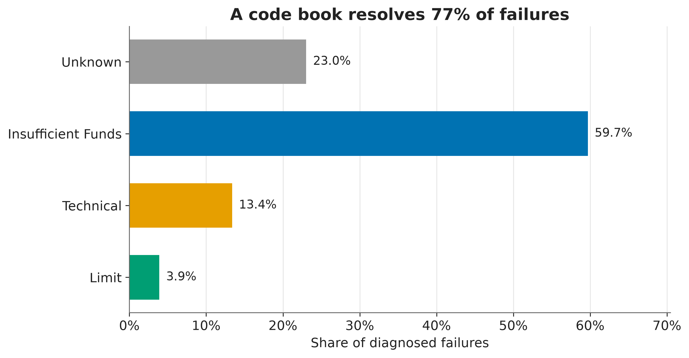

# Artha — The AI Recovery Agent

## Problem

UPI Autopay recurring mandates fail for reasons the collecting merchant cannot
see: an insufficient balance three days before payday, a bank-side outage, a
customer who has quietly decided to leave. The industry default is a fixed
retry schedule, which spends customer goodwill on payers who were never going
to pay and gives up on payers who would have paid on Friday. Artha is a
research harness that simulates these failures with explicit latent state and
evaluates recovery policies against them — on recovery rate, cost, and
customer-experience damage — under strict information asymmetry: a policy sees
only what a real collector could see, never the simulator's ground truth.

## Results so far

**The fixed-schedule baseline captures 50.1% of the available headroom. A
deterministic agent that diagnoses and retimes ties it — and the reason is
the cost of contacting customers, not the quality of the timing.**

Three arms across 120 paired seeds, 500 mandates each, 90 simulated days. Every
arm faces a bit-identical world on a given seed, so each comparison is a
within-subject measurement rather than a difference of two noisy averages.

| Arm | Net recovery | Recovery rate | Attempts/recovery | Headroom captured |
| --- | ---: | ---: | ---: | ---: |
| No intervention (floor) | Rs 11,866 L | 73.1% | 1.37 | 0% |
| Fixed schedule T+1/3/5 | Rs 13,641 L | 81.3% | 2.06 | 50.1% |
| Heuristic agent (no LLM) | Rs 13,623 L | 82.4% | 1.78 | 49.6% |
| Oracle, perfect information (ceiling) | Rs 15,409 L | 84.8% | 1.38 | 100% |

The fixed schedule beats doing nothing by Rs 1,479,068 per seed on average
(95% CI Rs 1,433,307 to Rs 1,523,914), **losing on 0 of 120 seeds**.

**The heuristic agent does not beat it:** mean delta Rs -15,265 (95% CI
Rs -52,047 to Rs +22,500), **losing on 63 of 120 seeds (52.5%)**. The interval
spans zero. Loss rate is reported next to every mean in this project and is
never omitted, including when it is inconvenient.

That result is more interesting than a win would have been. The agent recovers
*more* — 82.4% against 81.3%, with fewer attempts per recovery — but recovers
it more expensively. Contacting a customer raises their churn probability by
the calibrated increment, which on an Rs 8,800 mandate with a year left to run
costs about Rs 1,188 in expected lifetime value: roughly 13.5% of the mandate,
spent to buy a percentage point of recovery. **Under this cost model, nudging
is close to value-neutral, and the agent's edge in timing is spent paying for
it.** Details and the mechanism are in `PROGRESS.md` under commit 20.

A rule-based code book resolves 77% of failures. The remaining **23.0% return
UNKNOWN** — a generic code, a missing code, or a funds code that the
customer's own payment history cannot separate from a ceiling breach. That
number is the honest size of the gap a model stage would have to fill.

The oracle bounds *timing* only — it retimes retries using perfect knowledge of
every balance and every bank outage, but never contacts a customer. A policy
that persuades someone to top up their account could in principle exceed it.

### What these numbers are not

Every calibrated parameter behind them is an **unsourced placeholder** marked
`assumption`, and the simulator was fitted to those placeholders rather than to
observed data. See [`docs/CALIBRATION.md`](docs/CALIBRATION.md) for exactly
which numbers were chosen to match which, and
[`docs/MESSINESS.md`](docs/MESSINESS.md) for how much of the diagnostic
difficulty was manufactured. Reproduce them with `python scripts/run_baselines.py` and
`python scripts/run_heuristic.py`; results land in `results/baselines/`
and `results/heuristic/`.

## Status

🚧 **Under construction.** The simulator is built, calibrated, validated and
frozen ([`docs/FREEZE.md`](docs/FREEZE.md)); the evaluation harness, four
non-LLM arms, the compliance validator and the audit trail are in place. Still
to come: the LLM layer, the ablation that decides the headline claim, and the
sensitivity sweep. See `PROGRESS.md` for the running log.
