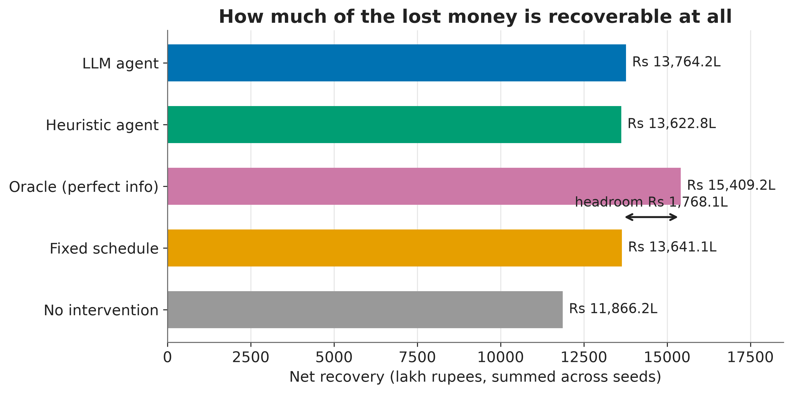
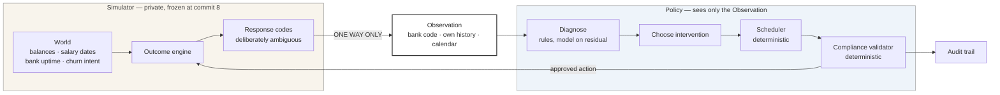

# Artha — The AI Recovery Agent

A research harness that simulates UPI Autopay recurring-payment failures and
evaluates recovery policies against them under strict information asymmetry.

## The problem

UPI Autopay mandates fail for reasons the collecting merchant cannot see: an
empty account three days before payday, a bank-side outage, a customer who has
quietly decided to leave. The industry default is a fixed retry schedule —
T+1, T+3, T+5 — which spends customer goodwill on payers who were never going
to pay and gives up on payers who would have paid on Friday. This project asks
whether a policy that *reasons* about why a payment failed can do better, and
holds itself to the constraint that a real collector faces: it sees the bank's
response code and its own settlement history, never the customer's balance.

**On the numbers below: none of them is a published figure.** Reported UPI
Autopay failure rates vary widely by source, reporting period, and whether
"failure" counts the first attempt or the whole retry sequence, and this
project does not cite a figure it cannot stand behind. Every parameter is an
author's assumption, labelled as such, with `TODO(sumit)` markers where a real
figure should go. See [`docs/CALIBRATION.md`](docs/CALIBRATION.md) for exactly
which numbers were chosen to match which, and why the simulator was fitted to
the placeholders rather than the other way round.

## The result

**The LLM agent beats the industry baseline by Rs 102,635 per seed (95% CI
Rs 76,192 to Rs 130,046), losing on 23.3% of seeds — and it wins by contacting
customers ten times less often, not by recovering more.**



120 paired seeds, 500 mandates each, 90 simulated days. Every arm faces a
bit-identical world on a given seed, so each comparison is a within-subject
measurement rather than a difference of two noisy averages.

| Arm | Net recovery | Recovery rate | Contacts/recovery | Cost per Rs 100 | Headroom |
| --- | ---: | ---: | ---: | ---: | ---: |
| No intervention (floor) | Rs 11,866 L | 73.1% | 0.000 | — | 0% |
| Fixed schedule T+1/3/5 | Rs 13,641 L | 81.3% | 0.000 | Rs 4.30 | 50.1% |
| Heuristic agent (no LLM) | Rs 13,623 L | 82.4% | 0.082 | Rs 4.89 | 49.6% |
| **LLM agent** | **Rs 13,764 L** | 82.0% | **0.008** | **Rs 1.54** | **53.6%** |
| Oracle, perfect information (ceiling) | Rs 15,409 L | 84.8% | 0.000 | Rs 2.60 | 100% |

| Comparison | Mean delta | 95% CI | Loss rate |
| --- | ---: | --- | ---: |
| **LLM agent vs heuristic** | **+Rs 117,900** | Rs 81,461 to 153,122 | **27.5%** |
| **LLM agent vs fixed schedule** | **+Rs 102,635** | Rs 76,192 to 130,046 | **23.3%** |
| Heuristic vs fixed schedule | −Rs 15,265 | −Rs 52,047 to +22,500 | 52.5% |

Loss rate — the share of the 120 worlds where an arm actually *lost* — sits
next to every mean in this project and is never omitted.

**The LLM agent does not win by recovering more money. It recovers slightly
less** — 82.0% against the heuristic's 82.4%, using *more* attempts per
recovery. It wins by contacting customers **ten times less often**, which
drops over-intervention from 8.4% to zero and cost per Rs 100 recovered from
Rs 4.89 to Rs 1.54.

Contacting a customer raises their churn probability by the calibrated
increment, which on an Rs 8,800 mandate with a year left to run costs about
Rs 1,188 in expected lifetime value — roughly 13.5% of the mandate, to buy
about one percentage point of recovery. The heuristic's decision table nudges
after two failed retries regardless. The model, told in its prompt what a
contact actually costs, mostly declined to make one. **Its contribution was
knowing when not to act.**

A rule-based code book resolves 77% of failures. The model was consulted on
the remaining **23.1%** — generic codes, missing codes, and funds codes that
history cannot separate from a ceiling breach — and resolved 89.4% of them.
The deterministic compliance validator still refused 20,853 of the actions the
pipeline produced. Detail in [`docs/ABLATION.md`](docs/ABLATION.md).

### Two things this project does not claim

**The winning arm has not been stress-tested.** The 54-regime sensitivity
sweep ran before the ablation, when no arm had won, so it covers the
*heuristic* agent — whose advantage survived only 37% of regimes, collapsing
when failures are frequent (6% of cells) or transaction ceilings are tight
(6%). Whether the LLM agent's advantage survives those same worlds is
**unmeasured**. See [`docs/SENSITIVITY.md`](docs/SENSITIVITY.md).

**An earlier run of the ablation said the opposite, and was discarded.** With
the response cache only 47% covered by call volume, 65% of the LLM arm's
decisions silently became heuristic decisions, and the run reported the LLM
agent *losing* by Rs 42,597 with a confidence interval excluding zero — same
code, same seeds. A partially-cached LLM arm does not fail loudly; it quietly
becomes its own control and returns a confident wrong answer. The cache is now
100% covered across 444 committed entries, verified by an iterative warming
process that converged over five rounds.

## Quickstart

```bash
git clone https://github.com/realSumit3646/Artha-The-AI-Recovery-Agent.git
cd Artha-The-AI-Recovery-Agent
make install          # needs Python 3.11 specifically
make test             # 560 tests
make reproduce        # every experiment, from stored configs
```

`make reproduce` runs the simulator validation, the baselines, the heuristic
experiment and the sensitivity sweep, and regenerates every figure. **No API
key is required** — the model layer runs entirely from the committed cache in
`llm_cache/` (444 entries, 100% call coverage). Add `--with-ablation` to
include the LLM comparison, which is also served from cache.

If your network intercepts TLS (corporate proxies, some antivirus), set
`SSL_CERT_FILE` to a bundle including the intercepting root. The client does
not disable certificate verification.

## Architecture



The single-headed arrow into `Observation` is the whole design. No policy
receives a `World` or a `LatentCustomerState`; the boundary is enforced by
types, by a test that walks every registered policy's signature *and*
constructor, and by a test asserting the `Observation` and
`LatentCustomerState` field sets are disjoint. The one exception is the
oracle, which declares `reads_latent_state = True`, must call itself an
upper-bound instrument in its own docstring, and exists only to compute the
ceiling.

## What is deterministic, and what is a model

| Deterministic | A language model |
| --- | --- |
| Whether an action is permitted at all | Which *kind* of action to take |
| The exact retry day and hour | A rough timing preference (soon / after salary / next cycle) |
| The amount of a partial collection | The tone of a customer message |
| Which rail, and whether a card exists | Diagnosis of ambiguous response codes only |
| Every rupee figure in every message | The phrasing around those figures |
| Cost accounting and metrics | — |

**No money-moving or compliance-gating decision is made by a model.** This is
enforced by the reply schema, not by convention: `InterventionReply` has
exactly four fields — `action`, `timing`, `tone_level`, `reasoning` — and a
test asserts no `amount`, `day`, `hour` or `rail` can appear in it. A model
reply saying "collect ten lakh immediately" parses into an enum member and
then meets a validator it cannot argue with.

For customer messages the model is never shown the amount, due date, mandate
reference or merchant name. It writes a *template* with placeholders and
Python substitutes the true values, and the verifier rejects **any digit at
all** in the template. A model that cannot see a number cannot get one wrong.

## Documentation

| Document | What it covers |
| --- | --- |
| [`docs/CALIBRATION.md`](docs/CALIBRATION.md) | Every parameter, its source, and which numbers were fitted to which |
| [`docs/MESSINESS.md`](docs/MESSINESS.md) | Why response codes are ambiguous on purpose, and how much |
| [`docs/FREEZE.md`](docs/FREEZE.md) | The simulator freeze, its hash, and what it does not cover |
| [`docs/ABLATION.md`](docs/ABLATION.md) | The heuristic-vs-LLM experiment, and why it has not run |
| [`docs/SENSITIVITY.md`](docs/SENSITIVITY.md) | Where the advantage holds and where it collapses |
| [`docs/LIMITATIONS.md`](docs/LIMITATIONS.md) | What is wrong with all of this |
| [`docs/ARCHITECTURE.md`](docs/ARCHITECTURE.md) | How the pieces fit and why |
| `PROGRESS.md` | Commit-by-commit log, including every judgement call and mistake |

## Status

All five milestones are built, including the ablation that decides the
headline claim. The
FastAPI service and React viewer from the original plan were deliberately cut
in favour of the sensitivity sweep and the reproduction path, per the plan's
own guidance on what to drop first.
