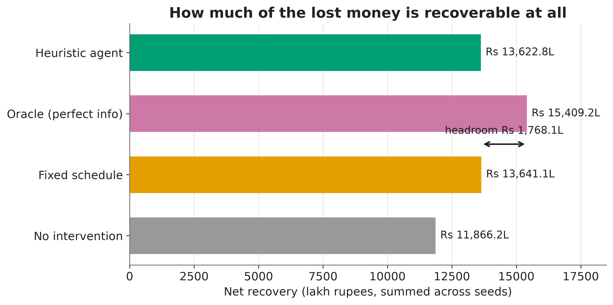
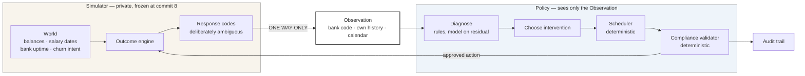

# Artha — The AI Recovery Agent

A research harness that simulates UPI Autopay recurring-payment failures and
evaluates recovery policies against them under strict information asymmetry.

## The problem

UPI Autopay mandates fail for reasons the collecting merchant cannot see: an
empty account three days before payday, a bank-side outage, a customer who has
quietly decided to leave. The industry default is a fixed retry schedule —
T+1, T+3, T+5 — which spends customer goodwill on payers who were never going
to pay and gives up on payers who would have paid on Friday. This project asks
whether a policy that *reasons* about why a payment failed can do better, and
holds itself to the constraint that a real collector faces: it sees the bank's
response code and its own settlement history, never the customer's balance.

**On the numbers below: none of them is a published figure.** Reported UPI
Autopay failure rates vary widely by source, reporting period, and whether
"failure" counts the first attempt or the whole retry sequence, and this
project does not cite a figure it cannot stand behind. Every parameter is an
author's assumption, labelled as such, with `TODO(sumit)` markers where a real
figure should go. See [`docs/CALIBRATION.md`](docs/CALIBRATION.md) for exactly
which numbers were chosen to match which, and why the simulator was fitted to
the placeholders rather than the other way round.

## The result

**The deterministic agent ties the industry baseline. Its advantage does not
generalise: across a 54-cell sweep of alternative worlds it survives in about
a third of them.**



120 paired seeds, 500 mandates each, 90 simulated days. Every arm faces a
bit-identical world on a given seed, so each comparison is a within-subject
measurement rather than a difference of two noisy averages.

| Arm | Net recovery | Recovery rate | Attempts/recovery | Headroom captured |
| --- | ---: | ---: | ---: | ---: |
| No intervention (floor) | Rs 11,866 L | 73.1% | 1.37 | 0% |
| Fixed schedule T+1/3/5 | Rs 13,641 L | 81.3% | 2.06 | 50.1% |
| Heuristic agent (no LLM) | Rs 13,623 L | 82.4% | 1.78 | 49.6% |
| Oracle, perfect information (ceiling) | Rs 15,409 L | 84.8% | 1.38 | 100% |

The heuristic agent against the fixed schedule: mean delta **Rs −15,265**
(95% CI Rs −52,047 to +22,500), **losing on 63 of 120 seeds (52.5%)**. The
interval spans zero.

It recovers *more* — 82.4% against 81.3%, with fewer attempts — and recovers
it more expensively. Contacting a customer raises their churn probability by
the calibrated increment, which on an Rs 8,800 mandate with a year left to run
costs about Rs 1,188 in expected lifetime value: roughly 13.5% of the mandate,
spent to buy a percentage point of recovery. **Under this cost model the
agent's edge in timing is spent paying for the contact that produced it.**

A rule-based code book resolves 77% of failures; the remaining **23.0% return
UNKNOWN** — a generic code, a missing code, or a funds code that history
cannot separate from a ceiling breach. That is the gap a model stage would
have to fill.

### Two things this project does not claim

**The LLM ablation has not run.** The model layer is built, tested and cached,
but the Gemini free tier allows 20 requests per day per model and the
experiment needs ~250–300 distinct calls. A live run warmed 17 cache entries,
then every call returned 429 and the agent fell back to the heuristic on every
decision — which would have produced an LLM arm numerically identical to the
control. **That run was discarded rather than recorded.** See
[`docs/ABLATION.md`](docs/ABLATION.md).

**The advantage is fragile.** The sensitivity sweep holds in 20 of 54 regimes
(37%), with 40 of 54 confidence intervals excluding zero — most of the losses
are as solid as the wins. It collapses when failures are frequent (6% of cells
hold) or ceilings are tight (6%). See
[`docs/SENSITIVITY.md`](docs/SENSITIVITY.md).

## Quickstart

```bash
git clone https://github.com/realSumit3646/Artha-The-AI-Recovery-Agent.git
cd Artha-The-AI-Recovery-Agent
make install          # needs Python 3.11 specifically
make test             # 528 tests
make reproduce        # every experiment, from stored configs
```

`make reproduce` runs the simulator validation, the baselines, the heuristic
experiment and the sensitivity sweep, and regenerates every figure. **No API
key is required**: the model layer runs from the committed cache in
`llm_cache/`, and the experiments that currently carry results use no model at
all.

If your network intercepts TLS (corporate proxies, some antivirus), set
`SSL_CERT_FILE` to a bundle including the intercepting root. The client does
not disable certificate verification.

## Architecture



The single-headed arrow into `Observation` is the whole design. No policy
receives a `World` or a `LatentCustomerState`; the boundary is enforced by
types, by a test that walks every registered policy's signature *and*
constructor, and by a test asserting the `Observation` and
`LatentCustomerState` field sets are disjoint. The one exception is the
oracle, which declares `reads_latent_state = True`, must call itself an
upper-bound instrument in its own docstring, and exists only to compute the
ceiling.

## What is deterministic, and what is a model

| Deterministic | A language model |
| --- | --- |
| Whether an action is permitted at all | Which *kind* of action to take |
| The exact retry day and hour | A rough timing preference (soon / after salary / next cycle) |
| The amount of a partial collection | The tone of a customer message |
| Which rail, and whether a card exists | Diagnosis of ambiguous response codes only |
| Every rupee figure in every message | The phrasing around those figures |
| Cost accounting and metrics | — |

**No money-moving or compliance-gating decision is made by a model.** This is
enforced by the reply schema, not by convention: `InterventionReply` has
exactly four fields — `action`, `timing`, `tone_level`, `reasoning` — and a
test asserts no `amount`, `day`, `hour` or `rail` can appear in it. A model
reply saying "collect ten lakh immediately" parses into an enum member and
then meets a validator it cannot argue with.

For customer messages the model is never shown the amount, due date, mandate
reference or merchant name. It writes a *template* with placeholders and
Python substitutes the true values, and the verifier rejects **any digit at
all** in the template. A model that cannot see a number cannot get one wrong.

## Documentation

| Document | What it covers |
| --- | --- |
| [`docs/CALIBRATION.md`](docs/CALIBRATION.md) | Every parameter, its source, and which numbers were fitted to which |
| [`docs/MESSINESS.md`](docs/MESSINESS.md) | Why response codes are ambiguous on purpose, and how much |
| [`docs/FREEZE.md`](docs/FREEZE.md) | The simulator freeze, its hash, and what it does not cover |
| [`docs/ABLATION.md`](docs/ABLATION.md) | The heuristic-vs-LLM experiment, and why it has not run |
| [`docs/SENSITIVITY.md`](docs/SENSITIVITY.md) | Where the advantage holds and where it collapses |
| [`docs/LIMITATIONS.md`](docs/LIMITATIONS.md) | What is wrong with all of this |
| [`docs/ARCHITECTURE.md`](docs/ARCHITECTURE.md) | How the pieces fit and why |
| `PROGRESS.md` | Commit-by-commit log, including every judgement call and mistake |

## Status

Milestones 1–4 are built; milestone 5 is documentation and reproduction. The
FastAPI service and React viewer from the original plan were deliberately cut
in favour of the sensitivity sweep and the reproduction path, per the plan's
own guidance on what to drop first.
