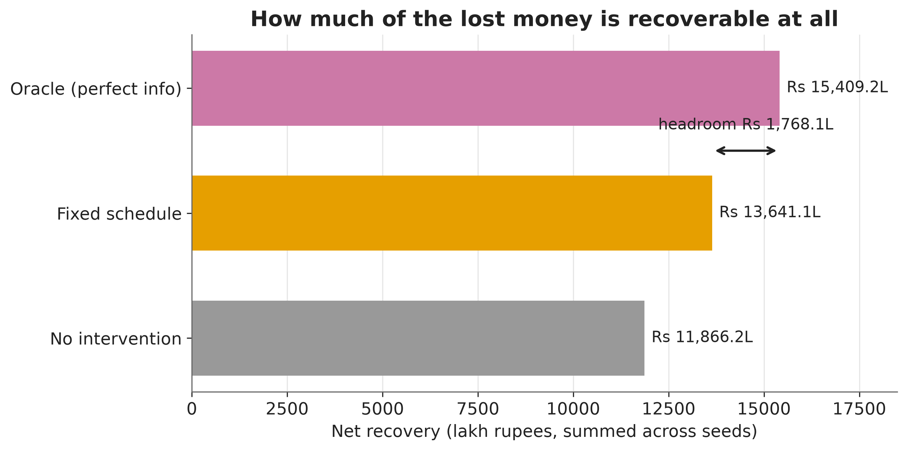

# Artha — The AI Recovery Agent

## Problem

UPI Autopay recurring mandates fail for reasons the collecting merchant cannot
see: an insufficient balance three days before payday, a bank-side outage, a
customer who has quietly decided to leave. The industry default is a fixed
retry schedule, which spends customer goodwill on payers who were never going
to pay and gives up on payers who would have paid on Friday. Artha is a
research harness that simulates these failures with explicit latent state and
evaluates recovery policies against them — on recovery rate, cost, and
customer-experience damage — under strict information asymmetry: a policy sees
only what a real collector could see, never the simulator's ground truth.

## Results so far

**The fixed-schedule baseline captures 50.1% of the available headroom. The
remaining Rs 1,768 lakh is what an agent is competing for.**

Three arms across 120 paired seeds, 500 mandates each, 90 simulated days. Every
arm faces a bit-identical world on a given seed, so each comparison is a
within-subject measurement rather than a difference of two noisy averages.

| Arm | Net recovery | Recovery rate | Attempts per recovery | Cost per Rs 100 |
| --- | ---: | ---: | ---: | ---: |
| No intervention (floor) | Rs 11,866 L | 73.1% | 1.37 | 0.029 |
| Fixed schedule T+1/3/5 | Rs 13,641 L | 81.3% | 2.06 | 0.043 |
| Oracle, perfect information (ceiling) | Rs 15,409 L | 84.8% | 1.38 | 0.026 |

The fixed schedule beats doing nothing by Rs 1,479,068 per seed on average
(95% CI Rs 1,433,307 to Rs 1,523,914), **losing on 0 of 120 seeds**. The oracle
beats the fixed schedule by Rs 1,473,412 per seed (95% CI Rs 1,433,814 to
Rs 1,514,393), also losing on 0 of 120. Loss rate is reported next to every
mean in this project and is never omitted.

The oracle bounds *timing* only — it retimes retries using perfect knowledge of
every balance and every bank outage, but never contacts a customer. A policy
that persuades someone to top up their account could in principle exceed it.

### What these numbers are not

Every calibrated parameter behind them is an **unsourced placeholder** marked
`assumption`, and the simulator was fitted to those placeholders rather than to
observed data. See [`docs/CALIBRATION.md`](docs/CALIBRATION.md) for exactly
which numbers were chosen to match which, and
[`docs/MESSINESS.md`](docs/MESSINESS.md) for how much of the diagnostic
difficulty was manufactured. Reproduce them with
`python scripts/run_baselines.py`; results land in `results/baselines/`.

## Status

🚧 **Under construction.** The simulator is built, calibrated, validated and
frozen ([`docs/FREEZE.md`](docs/FREEZE.md)); the evaluation harness and three
non-AI arms are in place. Still to come: the deterministic agent, the LLM
layer, the ablation that decides the headline claim, and the sensitivity
sweep. See `PROGRESS.md` for the running log.
