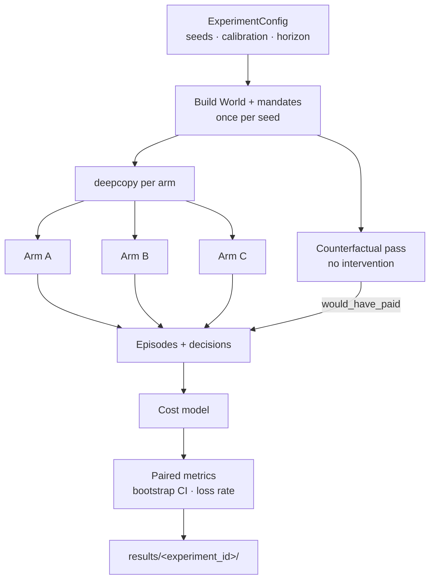
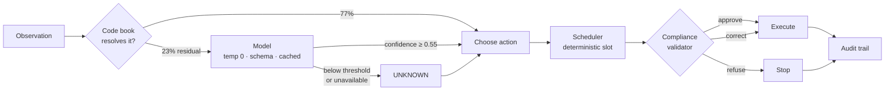

# Architecture

The core loop is **simulator → policy → metrics**. Everything else is
scaffolding around that, and two constraints shape all of it: policies must
not see the simulator's state, and no model may move money.

## The shape of a run



**The deep copy is the experiment.** For a given seed every arm faces a
bit-identical world, so the per-seed delta is a within-subject comparison
rather than a difference of two noisy averages. Recovery outcomes vary
enormously between seeds — one hands you customers who were going to pay
anyway, another hands you a bank outage — and comparing arms across different
worlds would measure the draw and call it a policy difference. A test asserts
two arms on seed 42 trace identical balances, and replacing the deep copy with
a shared world breaks six tests.

## The observation boundary

The simulator holds latent state: balance trajectories, salary dates, bank
uptime draws, churn intent, per-transaction ceilings. A policy receives one
object, `Observation`, carrying only what a real collector could look up.

Enforced in four places:

1. **The type.** `Observation` and `LatentCustomerState` field names are
   asserted disjoint, transitively through nested models.
2. **The signature.** Every registered policy's `decide` must take exactly one
   `Observation`, and its `__init__` is checked too — taking the `World` in the
   constructor is the obvious way around a signature check.
3. **The prompt.** Rendered prompts are checked against a real seeded `World`
   for latent *values*, not latent words. The prompt deliberately tells the
   model it does not have the balance; that is good design, not a leak.
4. **`extra="forbid"`.** Passing a latent fact as an extra keyword is a
   construction-time error, not a silently attached attribute.

The single exception is `OraclePolicy`, which declares
`reads_latent_state = True`, receives the `World` through its constructor
rather than through `decide`, and must call itself an upper-bound instrument
in its own docstring — a test enforces that wording, and another asserts it is
the only class in the registry with the flag.

## The decision pipeline



**Routing is the point.** The model is called only on failures the rules
cannot settle. Being able to say "the model was consulted on 23% of events and
the rest resolved deterministically" is the evidence that judgement was
applied where judgement was needed.

**The validator is never bypassed** — not by the heuristic agent, not by the
LLM agent, not by a confident model. It corrects timing errors (a retry an
hour too early, or inside the restricted window; a nudge decided at 05:00 gets
queued for 09:00) and refuses substantive violations (attempt caps, contact
caps, budget exhaustion, a card rail with no card). Either way the returned
action is the one that is safe to execute, so a caller that runs
`result.action` is compliant regardless of the verdict.

## Determinism

Every stochastic call takes an explicit `numpy.random.Generator` seeded from
the run config; passing a legacy `RandomState` is a `TypeError`. Bank
availability is **pre-drawn for the whole run** rather than sampled per call,
so asking twice gives the same answer — sampling on demand would mean a policy
that retried more often silently shifted the bank's uptime, which is a leak
dressed as noise.

Model calls use temperature 0 against a pinned model, never an alias. The
committed response cache means a stored experiment reproduces exactly **even
if the model itself is not deterministic**: the reproducibility guarantee
lives in the cache, not in the model's behaviour.

## The freeze

`SIMULATOR_HASH` is a SHA256 over the serialised calibration and the source of
`world.py`, `outcomes.py` and `response_codes.py`, with line endings
normalised so a Windows checkout hashes the same as a Linux one. If it moves,
the world moved, and every number measured against the old world is stale.

The ordering is the point: the simulator was frozen at commit 8, before any
policy existed, so nothing in it was chosen with knowledge of how a recovery
strategy would score. That is checkable in the git history rather than taken
on trust.

## Layout

```
src/mandate_recovery/
    types.py          domain model; the Observation boundary
    calibration.py    every number, labelled with its provenance
    costs.py          gateway, contact and churn accounting
    figures.py        one plotting style for the whole project
    sim/              world · outcomes · response codes · freeze
    agent/            scheduler · validator · audit trail
    policies/         do_nothing · fixed_schedule · oracle · heuristic · llm_agent
    llm/              client · cache · diagnosis · intervention · messaging
    prompts/          versioned prompt files, one per stage
scripts/              one script per experiment
results/<id>/         config · metrics · raw parquet · figures
```

Prompts are files rather than string literals so a prompt change shows up in a
diff and can be tied to the run that used it.
